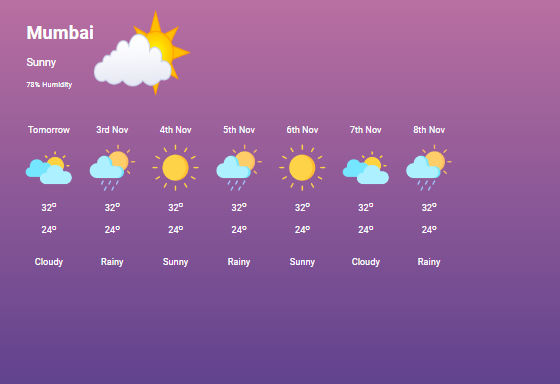

# Weather Forecast Page



This repository contains the source code for a responsive weather forecast web page. The page displays the current weather conditions and a forecast for the upcoming days. It is built using HTML and CSS and adapts to different screen sizes.

## Table of Contents

- [Features](#features)
- [Installation](#installation)
- [Usage](#usage)
- [Contributing](#contributing)


## Features

- **Responsive Design**: Adapts to different screen sizes, providing an optimal viewing experience on both mobile and desktop devices.
- **Weather Forecast**: Displays current weather conditions and forecasts for the upcoming days.
- **Visual Appeal**: Uses high-quality images and a clean layout to convey the weather information effectively.

## Installation

To run this project locally, follow these steps:

1. Clone the repository:
    ```sh
    git clone https://github.com/Ganeshmoorthii/Weather-Report-Templete.git
    ```

2. Navigate to the project directory:
    ```sh
    cd Weather-Report-Templete
    ```

## Usage

Open the `index.html` file in your preferred web browser to view the weather forecast page.

## Contributing

Contributions are welcome! Please fork this repository and submit a pull request with your changes. Make sure to update the documentation as needed.

